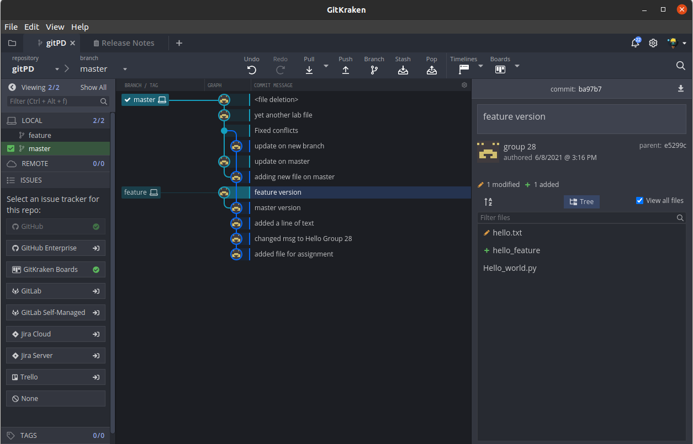

<h1 align="center"><strong>IFT 598 Project Report for Deliverable 2</strong></h1>

 A Project Report presented to the instructors of IFT 598 Middleware Programming and Database Security
 

By GROUP 28
 

<em>Hooman Mishaeil - Group 28</em>

<em>IFT 598 Session C, Summer 2021</em>

<em>hmishaei@asu.edu</em>
 

<em>Jeffrey Ashworth - Group 28</em>

<em>IFT 598 Session C, Summer 2021</em>

<em>jdashwo2@asu.edu </em>
 
  
- [**Introduction**](#introduction)
- [**Description**](#description)
- [**GitHub URL**](#github-url)

# **Introduction**
   For Deliverable 3, the team was charged with creating a local core git repository, manipulating source files through the local environment consisting of the working directory, staging area, and local repository, and finally creating a remote repository on GitHub.com to push the files and git history to. The team followed the instructions provided in the course materials and documented the process through terminal screenshots in the document "git_activites_Group_28.docx".  Embedded in the activities were four (4) questions requiring answers.  The team documented the answers in the document "deliverable3_answers_Group28.docx".  The two documents listed as well as the files created during the activities were pushed to a remote GitHub repository and the instructor was added as a contributor.
  

# **Description**
The project provided a section for an installation of Git, however the team uses Git actively and already had local installations in their environments.  Once a directory was created and a new repository initialized using Git commands such as "git init", a global configuration was provided to identify user name and contact email.  The team proceed to manipulate the source through the local environment, by creating local files in the working directory.  These files were then added to the staging area to be committed to the local repository.  Commits and messages were made to the local repository.  The exercises also had the team create branches in the context of new features.  For example, one may branch from the main or master branch to work on a feature and create a branch developer_name/feature_name.  This branch is then checked out to the working directory and changes (additions , updates, deletions, etc) are made and git "add"ed to the staging area for commit.  The exercise had the team make changes to the same files in different branches to demonstrate a change to a file in one branch will not be made to the file of the same name in another branch.  Using git status and git log, the team could identify the current state of the local branch and see the history of changes in the local repository.  Finally, a merge of branches was initiated, demonstrating the changes in files were indeed being tracked.  This highlighted the Git requirement to resolve merge conflicts before branches and files can be merged.  While a command line interface was used to execute the steps in the activities, the team reviewed the activities with a Git GUI product called Git Kraken.  

  The demonstration of the remote repository component of Git had the team use a GitHub account and create a remote repository.  The file from the exercises and additional required documentation was then pushed to the remote and the instructor added as a contributor.  While the team has been using the Git ecosystem though the entire class, branch management was learned to a greater degree as the team has had some challenges in fetching current branches to be sure to be ahead of the master when merges are to take place.  The team will use these techniques,the ability to review the logs through "git logs", and the use of a Git GUI to understand the project flow and make a smoother workflow for the team.

# **GitHub URL**
To clone the Group 28 GitHub repository via https, please use the following URL:

https://github.com/jazzworth-asu/gitPD28.git

